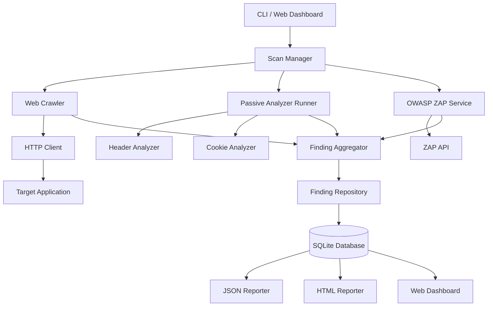

# WebSentinel

### Defensive Web Application Security Assessment Platform

WebSentinel is a Python-based web application security assessment platform designed for authorized security testing.

It crawls a target application, analyzes HTTP responses for common security weaknesses, optionally integrates with OWASP ZAP for active security testing, normalizes and deduplicates findings, stores scan results in SQLite, and provides CLI and Flask-based dashboard interfaces.


---

## Table of Contents

- [Features](#features)
- [Screenshots](#screenshots)
- [Architecture](#architecture)
- [Scan Lifecycle](#scan-lifecycle)
- [Installation](#installation)
- [Usage](#usage)
- [Dashboard](#dashboard)
- [OWASP ZAP Integration](#owasp-zap-integration)
- [Finding Model](#finding-model)
- [Reporting](#reporting)
- [Database](#database)
- [Security Hardening & Self-Audit](#security-hardening--self-audit)
- [Testing](#testing)
- [Project Structure](#project-structure)
- [Limitations](#limitations)
- [Future Improvements](#future-improvements)
- [Technology Stack](#technology-stack)
- [Disclaimer](#disclaimer)

---

## Features

| Feature | Description |
|---|---|
| **Web Crawler** | Crawls internal HTML pages while respecting domain restrictions and crawl limits |
| **Passive Security Analysis** | Checks HTTP security headers and cookie security attributes |
| **OWASP ZAP Integration** | Optionally orchestrates OWASP ZAP for active security testing |
| **Finding Management** | Normalizes, deduplicates, categorizes, and stores security findings |
| **Persistent Storage** | SQLite database using SQLAlchemy |
| **Reporting** | Generates JSON and standalone HTML security reports |
| **Web Dashboard** | Flask dashboard for launching scans and reviewing results |
| **CLI** | Command-line interface for scans, analysis, history, results, and reports |
| **Security Controls** | Domain allowlisting, request timeouts, crawl limits, and safe scanning boundaries |

---

## Screenshots

Screenshots of the dashboard, findings view, and generated reports will be added here.

---

## Architecture



The architecture separates crawling, analysis, ZAP integration, aggregation, persistence, reporting, and presentation.

This allows individual components to be tested and extended independently.

---

## Scan Lifecycle

A scan progresses through the following stages:

```text
QUEUED
   ↓
RUNNING
   ↓
CRAWLING
   ↓
ANALYZING
   ↓
ZAP_SCANNING
   ↓
AGGREGATING
   ↓
COMPLETED
```

If the optional ZAP stage encounters an error, the scan can finish with:

```text
COMPLETED_WITH_WARNINGS
```

Unexpected failures result in:

```text
FAILED
```

---

## Installation

### Requirements

* Python 3.9+
* pip
* Optional: OWASP ZAP for active security testing

### Clone the repository

```bash
git clone https://github.com/kartikeym88/websentinel.git
cd websentinel
```

### Create a virtual environment

Windows:

```bash
python -m venv .venv
.venv\Scripts\activate
```

Linux/macOS:

```bash
python3 -m venv .venv
source .venv/bin/activate
```

### Install dependencies

```bash
pip install -r requirements.txt
```

### Configuration

Copy the example environment file:

```bash
copy .env.example .env
```

Configure the target, request timeout, database path, and optional ZAP settings as required.

---

## Usage

### Start a scan

```bash
python scanner.py scan --target http://127.0.0.1:5002
```

The scan performs crawling, passive analysis, finding aggregation, persistence, and optionally ZAP analysis if configured.

### Run passive analysis

```bash
python scanner.py analyze --target http://127.0.0.1:5002
```

### View scan history

```bash
python scanner.py history
```

### View scan results

```bash
python scanner.py results --scan-id <SCAN_ID>
```

### Generate an HTML report

```bash
python scanner.py report --scan-id <SCAN_ID> --format html
```

### Generate a JSON report

```bash
python scanner.py report --scan-id <SCAN_ID> --format json
```

### Start the dashboard

```bash
python scanner.py web --port 5000
```

Then open:

```text
http://127.0.0.1:5000
```

---

## Dashboard

The Flask dashboard provides:

* Scan creation
* Scan history
* Scan status
* Finding summaries
* Severity information
* Individual scan results
* HTML report access
* JSON report access

Scans are executed in a background thread so the dashboard remains responsive while a scan is running.

---

## OWASP ZAP Integration

WebSentinel can optionally use OWASP ZAP as its active security testing engine.

The integration is structured into:

```text
ZAP Client
    ↓
ZAP Service
    ↓
ZAP Adapter
    ↓
Finding Aggregator
```

The ZAP service coordinates:

1. Spidering the target
2. Waiting for spider completion
3. Starting an active scan
4. Waiting for active scan completion
5. Retrieving ZAP alerts
6. Converting alerts into WebSentinel findings

ZAP risk and confidence levels are mapped into WebSentinel's normalized severity and confidence model.

### ZAP configuration

ZAP is optional. The platform can perform crawling and passive analysis without it.

The ZAP integration was tested using mocked ZAP responses during local validation. A live ZAP daemon was not available during the final local test run.

---

## Finding Model

Each security finding contains structured information such as:

* Title
* Description
* Severity
* Confidence
* Category
* URL
* HTTP method
* Parameter
* Evidence
* Source
* Remediation guidance

Findings are normalized before persistence.

The aggregator uses a fingerprint based on:

```text
category | URL | method | parameter | title
```

This prevents duplicate findings from different analysis sources from being stored multiple times.

---

## Reporting

WebSentinel supports two report formats.

### JSON

Machine-readable output suitable for:

* Automation
* Further processing
* Integration with other tools

Example:

```bash
python scanner.py report --scan-id 1 --format json
```

### HTML

Standalone human-readable security reports containing:

* Scan information
* Finding counts
* Severity summaries
* Finding details
* Evidence
* Remediation information

Example:

```bash
python scanner.py report --scan-id 1 --format html
```

---

## Database

WebSentinel uses SQLite with SQLAlchemy.

The database stores:

### Scans

Information about each scan including:

* Target
* Status
* Start time
* End time
* Scan statistics

### Findings

Normalized security findings associated with a scan.

### Pages

Crawled pages and related response information.

The database is stored locally and is excluded from version control.

---

## Security Hardening & Self-Audit

WebSentinel includes security hardening for its own Flask dashboard.

Centralized response headers include:

* Content-Security-Policy
* X-Content-Type-Options
* Referrer-Policy
* Permissions-Policy
* X-Frame-Options

A `robots.txt` endpoint also prevents search engine indexing of scan and report routes.

### Self-audit result

When WebSentinel was initially scanned against itself, the passive analyzer produced **145 findings** related to missing security headers across the dashboard and report routes.

After implementing the centralized security headers, the same self-audit produced **0 findings** from those currently implemented passive security-header checks.

This result does **not** prove that WebSentinel contains no vulnerabilities. It only demonstrates that the specific passive checks implemented by the current analyzer no longer reported those findings.

---

## Testing

The project includes unit, integration, and end-to-end tests.

Current test result:

```text
41 passed
0 failed
```

The test suite covers:

* URL normalization
* Domain restrictions
* Crawl depth
* Crawl limits
* HTML parsing
* Form extraction
* Passive security analysis
* Cookie analysis
* Finding aggregation
* Database persistence
* Scan orchestration
* ZAP adapter behavior
* ZAP timeout handling
* Dashboard routes
* Security headers
* End-to-end scanning

---

## Project Structure

```text
web-security-platform/
│
├── app/
│   ├── analyzers/
│   │   ├── base.py
│   │   ├── cookies.py
│   │   ├── headers.py
│   │   └── runner.py
│   │
│   ├── core/
│   │   └── scan_manager.py
│   │
│   ├── crawler/
│   │   ├── models.py
│   │   └── spider.py
│   │
│   ├── database/
│   │   ├── models.py
│   │   ├── repository.py
│   │   └── session.py
│   │
│   ├── findings/
│   │   ├── aggregator.py
│   │   └── models.py
│   │
│   ├── http/
│   │   ├── client.py
│   │   └── response.py
│   │
│   ├── reporting/
│   │   ├── html_reporter.py
│   │   └── json_reporter.py
│   │
│   ├── web/
│   │   ├── routes.py
│   │   └── templates/
│   │
│   └── zap/
│       ├── adapter.py
│       ├── client.py
│       ├── models.py
│       └── service.py
│
├── tests/
│   ├── fixtures/
│   └── ...
│
├── data/
├── reports/
├── scanner.py
├── config.py
├── requirements.txt
├── .env.example
└── README.md
```

---

## Limitations

Current limitations include:

* Static HTML crawling only
* No JavaScript execution during crawling
* No custom SQL injection or XSS detection/exploitation engine
* SQL injection and XSS findings from active testing depend on optional OWASP ZAP integration
* No authentication-attack automation
* Passive analysis currently focuses primarily on security headers and cookies
* Live ZAP behavior was not available during the final local validation
* ZAP scans that time out may continue running in the background because cancellation is not currently implemented
* The crawler keeps normalized responses in memory during a crawl, which is acceptable for small scan limits but could be optimized for larger applications

---

## Future Improvements

Potential future improvements include:

* JavaScript-aware crawling
* Additional passive security analyzers
* Authentication-aware authorized scanning
* Improved report visualizations
* More robust background job management
* Live ZAP integration testing
* Docker support
* CI/CD security testing workflows

---

## Technology Stack

| Technology         | Purpose                            |
| ------------------ | ---------------------------------- |
| **Python**         | Core application and orchestration |
| **Requests**       | HTTP communication                 |
| **BeautifulSoup4** | HTML parsing                       |
| **lxml**           | HTML/XML parsing support           |
| **Pydantic**       | Finding and data validation        |
| **SQLAlchemy**     | Database ORM                       |
| **SQLite**         | Local persistence                  |
| **Flask**          | Web dashboard                      |
| **OWASP ZAP**      | Optional active security testing   |
| **Pytest**         | Automated testing                  |

---

## Disclaimer

> **⚠️ Authorized testing only.**
> WebSentinel is intended for applications you own or have explicit written permission to test. Use it with local security-training targets or other explicitly authorized environments. Do not scan public websites without authorization.

WebSentinel is an educational and defensive security assessment project.

It is intended for authorized security testing, security education, and assessment of applications owned by the user or explicitly authorized for testing.

The author is not responsible for unauthorized scanning, misuse, damage, disruption, or other consequences resulting from use of this software.

Always obtain appropriate authorization before testing a system.
